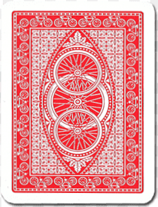

# 🃏 Blackjack Trainer - Streamlit App

Este es un simulador interactivo de Blackjack desarrollado con **Python + Streamlit**, ideal para entrenar estrategia básica, conteo de cartas y simular resultados de forma visual y profesional.



---

## 🚀 Funcionalidades

-  Juego completo de Blackjack con múltiples manos y división, dividir, doblar, pedir, plantarse
-  Estadísticas en tiempo real (wins, push, losses)
-  Sugerencias en vivo basadas en **estrategia básica + true count** con conteo de cartas y `true count`
-  Simulaciones rápidas con porcentaje de victoria
-  Renderizado de cartas con imágenes reales estilo casino

---

## 🏗️ Estructura del Proyecto

```
blackjack-trainer/
├── app.py                  # Aplicación principal de Streamlit
├── BlackjackS17.py         # Lógica y motor del juego
├── imgs_cartas/            # Imágenes PNG/JPG de cartas
├── requirements.txt        # Dependencias
└── README.md               # Este archivo
```

---

## ▶️ ¿Cómo correrlo?

1. Clona el repositorio:
   ```
   git clone https://github.com/tu-usuario/blackjack-trainer.git
   cd blackjack-trainer
   ```

2. Crea un entorno virtual (opcional pero recomendado):
   ```
   python -m venv venv
   source venv/bin/activate  # o venv\Scripts\activate en Windows
   ```

3. Instala las dependencias:
   ```
   pip install -r requirements.txt
   ```

4. Corre la app:
   ```
   streamlit run app.py
   ```

---

## 🧠 ¿Cómo funciona?

La app está basada en lógica modular:
- `BlackjackS17.py` contiene funciones como `make_shoe`, `hit`, `contar_mano`, `dealer_play_sim`, etc.
- `app.py` maneja la interfaz y lógica de juego con `streamlit.session_state`
- Las cartas se muestran con imágenes base64 embebidas

---

## 📸 Imágenes

Asegúrate de mantener la carpeta `imgs_cartas/` con las cartas nombradas como:

```
A_spades.png, 10_hearts.jpg, card_back.png, ...
```

---

## 👨‍💻 Autor

Desarrollado por DorianKid 
Con ❤️ para jugadores y practicantes de blackjack.

---

## 📄 Licencia

Este proyecto está bajo la licencia MIT. Puedes usarlo, modificarlo y distribuirlo libremente.
